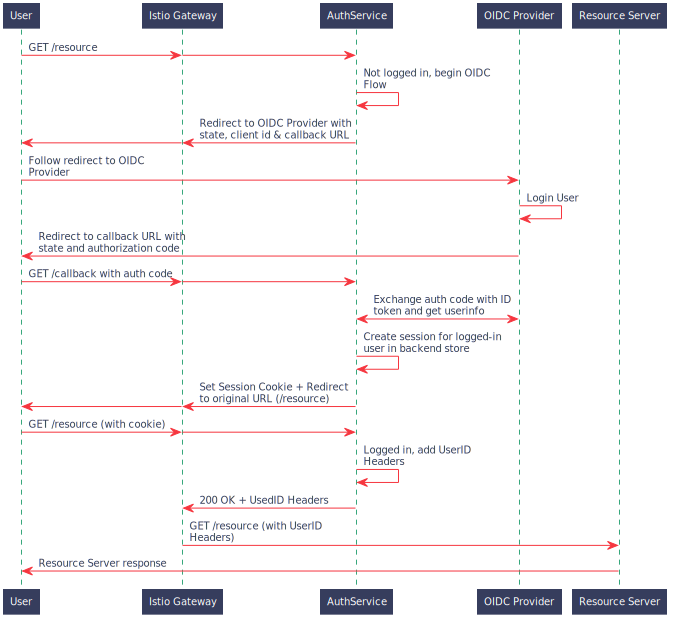

# OIDC AuthService

This is a rewrite of the [ajmyyra/ambassador-auth-oidc](https://github.com/ajmyyra/ambassador-auth-oidc) project.

An AuthService is an HTTP Server that an API Gateway (eg Ambassador, Envoy) asks if an incoming request is authorized.

For more information, see [this article](https://journal.arrikto.com/kubeflow-authentication-with-istio-dex-5eafdfac4782).

## OpenID Connect

[OpenID Connect (OIDC)](http://openid.net/connect/) is an authentication layer on top of the OAuth 2.0 protocol. As OAuth 2.0 is fully supported by OpenID Connect, existing OAuth 2.0 implementations work with it out of the box.

Currently it only supports OIDC's [Authorization Code Flow](http://openid.net/specs/openid-connect-basic-1_0.html#CodeFlow), similar to OAuth 2.0 Authorization Code Grant.

## Sequence Diagram for an Authentication Flow

## Design Docs

For more details on how various aspects of the AuthService are designed, see the design doc for the relevant section:
* [Logout](docs/logout.md)

## Architecture

The AuthService contains two server processes.
* The Judge Server, which is used for communication with the proxy asking if a request is allowed.
  The proxy (Envoy, Ambassador, ...) will make a request, with the same method and headers as the
  request it wants to ask about, at the Judge Server. If the request is authenticated, the Judge Server
  replies with 200 and the original request is forwarded upstream. If the request is forbidden,
  the authservice will reply with a redirect to initiate the OIDC login.
* A web server, to host necessary endpoints that need to be accessible to the user. These endpoints
  include the OIDC client redirect URL, the logout endpoint and helper HTML pages.

## Options

Following environment variables are used by the software.

**Compulsory**
| Setting | Description |
| - | - |
| `OIDC_PROVIDER` |  URL to your OIDC provider. AuthService expects to find information about your OIDC provider at `OIDC_PROVIDER/.well-known/openid-configuration`, and will use this information to contact your OIDC provider and initiate an OIDC flow later on.|
| `AUTHSERVICE_URL_PREFIX` | AuthService expects end users will be able to access its Web-based UI from the outside world at `AUTHSERVICE_URL_PREFIX`. Usually, it's in the form of `<APP_URL>/authservice/` It expects that your API Gateway will route any URL that starts with `AUTHSERVICE_URL_PREFIX` (@yanniszark) to it, so it can expose its default Web-based UI and API endpoints. AuthService will use this value to auto-generate sane defaults for a number of settings, including `HOMEPAGE_URL`, `LOGOUT_URL`, and `AFTER_LOGOUT_URL`. The default value, `/authservice/` will work out of the box with an Istio `VirtualService` specifying `/authservice/` as its `prefix`. |
| `CLIENT_ID` | AuthService will use this Client ID when it needs to contact your OIDC provider and initiate an OIDC flow. |
| `CLIENT_SECRET` | AuthService will use this Client Secret to authenticate itself against your OIDC provider in combination with `CLIENT_ID` when attempting to access your OIDC Provider's protected endpoints |

**Optional**
| Setting | Default | Description |
| - | - | - |
| `REDIRECT_URL` | `AUTHSERVICE_URL_PREFIX/oidc/callback` | AuthService will pass this URL to the OIDC provider when initiating an OIDC flow, so the OIDC provider knows where it needs to send the OIDC authorization code to. It defaults to `AUTHSERVICE_URL_PREFIX/oidc/callback`. This assumes that you have configured your API Gateway to pass all requests under a hostname to Authservice for authentication. |
| `OIDC_AUTH_URL` | `<empty>` | AuthService will initiate an Authorization Code OIDC flow by hitting this URL. Normally discovered automatically through the OIDC Provider's well-known endpoint. |
| `CLIENT_NAME` | `AuthService` |A user-visible description for AuthService as an OIDC Client. It is recommended that you set it to a user-visible name for the application/domain that AuthService protects, e.g., `MyApp`. AuthService will *not* use this as part of contacting your OIDC Provider, but it will use it to auto-generate user-visible message in the frontend. , e.g., "You are now logged out of MyApp. Click here to log in again." |
| `OIDC_SCOPES` | `openid,email` | Comma-separated list of [scopes](https://openid.net/specs/openid-connect-core-1_0.html#ScopeClaims) to request access to. The `openid` scope is always added. |
| `AUDIENCES` | `istio-ingressgateway.istio-system.svc.cluster.local` | Audiences that the authservice identifies as. Used for authenticators that support audience-scoped tokens. Currently, that is only the Kubernetes authenticator. The default value assumes that the authservice is used at the Istio Gateway in namespace `istio-system`.|
| `SERVER_HOSTNAME` | `<empty>` | Hostname to listen for judge requests. This is the server that proxies contacts to ask if a request is allowed. The default empty value means all IPv4/6 interfaces (0.0.0.0, ::). |
| `SERVER_PORT` | `8081` | Port to listen to for judge requests. This is the server that proxies contacts to ask if a request is allowed. |
| `SKIP_AUTH_URLS` | `<empty>` | Comma-separated list of URL path-prefixes for which to bypass authentication. For example, if `SKIP_AUTH_URL` contains `/my_app/` then requests to `<url>/my_app/*` are allowed without checking any credentials. Contains nothing by default. |
| `CA_BUNDLE` | `<empty>` | Path to file containing custom CA certificates to trust when connecting to an OIDC provider that uses self-signed certificates. |
| `AFTER_LOGIN_URL` | `<originally visited url>` | URL to redirect the user to after they login. Defaults to the URL that the user originally visited before they were redirected for login. For example, if a user visited `<app_url>/example` and were redirected for login, they will be redirected to `/example` after login is complete. |
| `HOMEPAGE_URL` | `AUTHSERVICE_URL_PREFIX/site/homepage` | Homepage of the application that can be accessed by anonymous users. |
| `AFTER_LOGOUT_URL` | `AUTHSERVICE_URL_PREFIX/site/homepage` | URL to redirect the user to after they logout. This option used to be called `STATIC_DESTINATION_URL`. For backwards compatibility, the old environment variable is also checked.|
| `AUTH_HEADER` | `Authorization` | When the AuthService logs in a user, it creates a session for them and saves it in its database. The session secret value is saved in a cookie in the user's browser. However, for programmatic access to endpoints, it is better to use headers to authenticate. The AuthService also accepts credentials in a header configured by the `AUTH_HEADER` setting. |
| `ID_TOKEN_HEADER` | `Authorization` | When id token is carried in this header, OIDC Authservice verifies the id token and uses the `USERID_CLAIM` inside the id token. If the `USERID_CLAIM` doesn't exist, the authentication would fail.|

The AuthService provides a web server with some defaults pages for a `homepage`
and an `after_logout` page. The following values are about these pages. To
learn more about how these pages work, see [the templating guide](docs/templates.md).

By default, this web server listens at port `8082` and its endpoints are:
| Endpoint | Description |
| - | - |
| `/site/homepage` | Landing page |
| `/site/after_logout` | After Logout page |
| `/site/themes` | Themes |

To expose the web server in an environment like Kubernetes with Istio, you need to:
- Create a Service pointing to the AuthService's web server port (8082).
- Create an Istio VirtualService to match traffic with the `$AUTHSERVICE_URL_PREFIX`
   path-prefix and direct it to the Service you created. Usually, the `AUTHSERVICE_URL_PREFIX`
   is in the form of `<url>/<path>` (e.g,. `<url>/authservice`). Make sure your VirtualService
   captures requests with the `<path>`.

| Setting | Default | Description |
| - | - | - |
| `TEMPLATE_PATH` | `web/templates/default` | A comma-separated list of dirs to look under for templates. Templates with the same name override previously registered ones. For more information, see [the templating guide](docs/templates.md). It always contains the default templates. |
| `CLIENT_NAME` | `AuthService` | A human-readable name for the client. Used in the web server's pages. |
| `THEMES_URL` | `themes` | URL where the themes are served. Theme assets are found under `THEMES_URL/THEME`. To learn how you can create your own theme, see [the templating guide](docs/templates.md). |
| `THEME` | `kubeflow` | Path under `THEMES_URL` where the theme assets are served. |
| `TEMPLATE_CONTEXT_<key>` | `empty` | Variables that will end up in the user-defined map in the template context. For example, if you define `TEMPLATE_CONTEXT_KEY=VALUE`, then a `KEY: VALUE` entry will be added to the user-defined map in the template context. Used to pass values to site templates and allow for further customization. |

OIDC-AuthService stores sessions and other state in a local file using BoltDB.
Session store-related settings:

| Setting | Default | Description |
| - | - | - |
| `SESSION_STORE_PATH` | "/var/lib/authservice/data.db" | Path to local session store. Backed by BoltDB. |
| `OIDC_STATE_STORE_PATH` | "/var/lib/authservice/oidc_state.db" | Path to the session store used to save the sessions for the OIDC state parameter. |
| `SESSION_MAX_AGE` | "86400" | Time in seconds after which sessions expire. Defaults to a day (24h). |
| `SESSION_SAME_SITE` | "Lax" | SameSite attribute of the session cookie. Check details of SameSite attribute [here](https://developer.mozilla.org/en-US/docs/Web/HTTP/Headers/Set-Cookie/SameSite). Its value can be "None", "Lax" or "Strict". |
| `SESSION_DOMAIN` | "" | Domain attribute of the session cookie. Check details of Domain attribute [here](https://developer.mozilla.org/en-US/docs/Web/HTTP/Headers/Set-Cookie). If len(SESSION_DOMAIN) > 0 the incoming request's host and scheme are also saved in the state rather than just the path. This enables AuthService to service all subdomains of SESSION_DOMAIN. |
| `SCHEME_DEFAULT` | `https` | Default scheme for incoming requests. |
| `SCHEME_HEADER` | `<empty>` | Header to use for incoming request scheme. If ommitted or header is not present in request, SCHEME_DEFAULT will be used instead. |

By default, the AuthService keeps sessions to check if a user is authenticated. However, there may be times where
we want to check a user's logged in status at the Provider, effectively making the Provider the one keeping the
user's logged in status to enable access revocation scenarios and centralized management.

| Setting | Default | Description |
| - | - | - |
| `STRICT_SESSION_VALIDATION` | `false` | Be strict about session validity by quering the OIDC provider for the validity of the token at each individual request, by hitting the userinfo endpoint. This ensures the authservice can detect an OIDC token has been revoked on the OIDC provider immediately, and destroy its own session. However, it may increase the load on the OIDC provider and introduces additional latency. Disabled by default, enable with "on" OR "true". |

OIDC AuthService can add extra headers based on the userid that was detected.
Applications can then use those headers to identify the user.

| Setting | Default | Description |
| - | - | - |
| `USERID_CLAIM` | "email" |Claim whose value will be used as the userid (default `email`). |
| `GROUPS_CLAIM` | "groups" | Claim whose value will be used as the user's groups (default `groups`) |
| `USERID_HEADER` | "" | Name of the header containing the user-id to be added to the upstream request. Header omitted if unset |
| `USERID_PREFIX` | "" | Prefix to add to the userid, which will be the value of the `USERID_HEADER`. |
| `USERID_TRANSFORMERS` | "" | List of transformations for the userid value (from `USERID_CLAIM`) in JSON format `[{"matches": "regex", "replaces": "value"}, ...]`. OIDC AuthService will evaluate the transformation rules in order and if the `matches` pattern matches the userid, the match is replaced by the `replaces` value.  **If multiple rules match, only the first one is applied** and if no rule matches the userid, the original userid will be used. For the `matches` regular expression, use the standard `golang` syntax [(more info)](https://golang.org/pkg/regexp/). Note that a regular expression is a string and the `\` **must be escaped** (using `\\`). For example using `USERID_TRANSFORMERS = '[{"matches": "user@domain\\.com$", "replaces": "internal"}, {"matches": "@domain\\.com$", "replaces": ""}]'`, AuthService will do the following transformation:  `user@domain.com` -> `internal` and `another@domain.com` -> `another`. |
| `GROUPS_HEADER` | "" | Name of the header containing the groups to be added to the upstream request. Header omitted if unset |
| `TOKEN_HEADER` | "Authorization" | Name of the header containing user id token (JWT) that will be added to the upstream request. |
| `TOKEN_SCHEME` | "Bearer" | Authorization scheme (e.g. Bearer, Basic) used for user id token. |

OIDC AuthService can also perform basic authorization checks. The following
settings are related to authorization:

| Setting | Default | Description |
| - | - | - |
| `GROUPS_ALLOWLIST` | "*" | List of groups that are allowed to pass authorization. By default, all groups are allowed. If you change this option, you may want to include the `system:serviceaccounts` group explicitly, if you need the AuthService to accept ServiceAccountTokens. |

## Usage

OIDC-Authservice is an OIDC Client, which authenticates users with an OIDC Provider and assigns them a session.
Can be used with:
* Ambassador with AuthService
* Envoy with the ext_authz Filter
* Istio with EnvoyFilter, specifying ext_authz

### Build

* Local: `make build`
* Docker: `make docker-build`

# E2E Tests

For E2E tests, we use [K3d](https://k3d.io/), a very lightweight way to run a
K8s cluster locally using Docker. For E2E tests to work, you need the following
external tools:

* `go (>=1.13)`
* `kustomize`
* `kubectl`
* `k3d`

You can use `make bin/deps` to install them locally under `./bin/deps`. Then
simply run `make e2e`.
